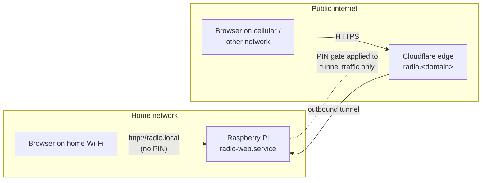

# Remote Access for the Pi Controller

## Summary

Publish the Pi's controller UI at `radio.<user-domain>` over HTTPS via Cloudflare Tunnel, gated by a shared PIN. LAN access at `radio.local` keeps working with no PIN. Past the PIN, the remote UI is the same surface operators use locally — playback, station, presets, reboot, logs.

---

## Problem Frame

The radio controller currently runs on a Raspberry Pi at `radio.local`, reachable only from devices on the same home Wi-Fi. The operator wants to use the controller while travelling, on a phone connected to cellular data, or from another network where their phone is. Today there is no path to do that without manual workarounds (asking someone at home to fix it, accepting whatever station the Pi happens to be on, or building a one-off SSH tunnel).

The cost shape is small but persistent: any change of station, restart, or status check requires being on the home network. Sharing the controller with a friend visiting another location — same problem.

---

## Topology

---

## Actors

- A1. **Operator** — the Pi owner. Provisions the tunnel, sets and rotates the PIN, uses the UI on both the LAN and remotely.
- A2. **Remote guest** — anyone the operator hands the URL and PIN to. Same capabilities as the operator once past the gate; differs only by access path.

---

## Key Flows

- F1. **Remote operator session**
  - **Trigger:** Operator opens `https://radio.<domain>` from a non-home network.
  - **Actors:** A1
  - **Steps:**
    1. Cloudflare edge accepts the request and forwards it through the tunnel to the Pi.
    2. The Pi sees no valid session cookie and serves the PIN gate page.
    3. Operator enters the PIN; the Pi validates, issues a session cookie, and redirects to the UI.
    4. Subsequent requests carry the cookie and bypass the gate until expiry or PIN rotation.
  - **Outcome:** Operator has the same control surface remotely as on the LAN.
  - **Covered by:** R1, R2, R4, R7, R9

- F2. **PIN rotation**
  - **Trigger:** Operator decides the PIN is stale (shared too widely, suspected leak, periodic refresh).
  - **Actors:** A1
  - **Steps:**
    1. Operator edits the PIN on the Pi (config file or env var).
    2. Operator restarts the service.
    3. Any existing remote sessions are invalidated; next request re-prompts for the new PIN.
    4. LAN access is unaffected throughout.
  - **Outcome:** Old PIN can no longer authenticate; existing remote sessions must re-authenticate.
  - **Covered by:** R5, R8, R3

---

## Requirements

**Network exposure**
- R1. The controller UI is reachable over HTTPS from any internet-connected network at a stable URL on the operator's owned domain (e.g., `radio.<domain>`).
- R2. Reachability does not require port forwarding on the home router or exposing the home public IP address.
- R3. The existing LAN URL `http://radio.local` continues to work unchanged. LAN access requires no PIN.

**Authentication**
- R4. Access via the public URL is gated by a shared PIN/password. Anyone with the correct PIN is granted access.
- R5. The PIN is stored on the Pi outside source control. The operator can rotate it by editing local configuration and restarting the service.
- R6. The login form rate-limits failed PIN attempts and temporarily locks out the source after repeated failures.

**Session**
- R7. Successful PIN entry establishes a session (cookie-based) so subsequent requests bypass the gate for a bounded duration.
- R8. Rotating the PIN invalidates all existing sessions; previously-authenticated visitors must re-enter the new PIN.

**Capability surface**
- R9. Past the gate, the remote UI exposes the same control surface as today's LAN UI: playback, volume/mute, station change, presets, reboot, logs viewer.
- R10. The PIN gate applies to traffic arriving via the public URL. Traffic arriving over the LAN bypasses the gate. The app must distinguish the two reliably.

**Tunnel operations**
- R11. The public path is provisioned via Cloudflare Tunnel on a domain the operator owns and controls. Cloudflare's free tier is sufficient.
- R12. Tunnel credentials and hostname configuration live on the Pi outside source control.
- R13. If the tunnel is down or Cloudflare is unreachable, LAN access continues to work unchanged.
- R14. The tunnel reconnects automatically when the Pi reboots, managed by a systemd-style service unit similar to `radio-web.service`.

---

## Acceptance Examples

- AE1. **Covers R4.** Given a fresh browser at `https://radio.<domain>/`, when the user enters an incorrect PIN, the gate page returns an "incorrect" state and no session cookie is issued.
- AE2. **Covers R6.** Given 5 consecutive failed PIN attempts from the same source within a short window, when a 6th attempt arrives, the form returns a rate-limit response rather than checking the PIN.
- AE3. **Covers R3, R10.** Given a browser on the home LAN opening `http://radio.local`, when any UI action is taken, no PIN is requested and the action succeeds (UX identical to today).
- AE4. **Covers R8.** Given a remote browser with a valid session cookie, when the operator rotates the PIN and the service restarts, the next request from that browser is re-prompted for the new PIN.
- AE5. **Covers R13.** Given a working LAN setup, when the tunnel process or Cloudflare edge is unreachable, opening `radio.local` from the home network still serves the full UI normally.
- AE6. **Covers R9.** Given an authenticated remote session, when the operator presses Reboot Pi (with the two-tap confirmation), the Pi reboots and the tunnel reconnects automatically once the service is back up.

---

## Success Criteria

- The operator can open `https://radio.<domain>` on a phone connected to cellular data, enter the PIN, and use the full controller UI — no client install, no manual setup on the phone.
- LAN UX is unchanged: opening `radio.local` from home requires no PIN and behaves identically to today.
- The operator can rotate the PIN in under a minute (edit config, restart service) and confirm via a remote browser that the old PIN no longer works.
- `ce-plan` can produce a build plan without inventing the auth model, the tunnel choice, the permission tiering, or the boundary between LAN and remote traffic.

---

## Scope Boundaries

- Tailscale or any other client-install VPN approach.
- Per-user identities, email allowlists, Google/OAuth login, magic links.
- Two-tier permission model (viewer vs operator); past the gate is always full control.
- Anonymous read-only "now playing" public endpoint.
- Streaming the Pi's audio output to a remote browser — the Evenings stream URL is already publicly playable, so remote listening is independently solved and not part of this work.
- DDNS, port forwarding, or any home-router configuration.
- Paid infrastructure (VPS, Cloudflare paid tier).
- Captcha, MFA, hardware tokens.
- Persistent audit logging of PIN attempts beyond the rate-limit counter.

---

## Key Decisions

- **Cloudflare Tunnel over port forwarding.** Avoids exposing the home IP, sidesteps CGNAT entirely, no router admin needed, free tier sufficient.
- **App-level PIN over Cloudflare Access.** Cloudflare Access is email-identity-based and has no clean "shared password" mode. App-level PIN matches the chosen auth shape directly instead of forcing the operator into email allowlists.
- **Single permission tier.** Mirrors today's LAN model (gate = trust boundary). Adding viewer/operator tiers would mean designing and maintaining a permission system inside the app for marginal benefit at this scale.
- **LAN bypass instead of always-on PIN.** Daily home use is the primary path; forcing PIN entry on `radio.local` would add friction with no security benefit — the LAN is already the trust boundary in the operator's model.
- **Tailscale rejected.** Requires client install on every device that wants in. Operator wants a URL that any browser can open, which Tailscale cannot deliver.

---

## Dependencies / Assumptions

- The operator has (or will create) a free Cloudflare account.
- The operator owns a domain whose DNS can be hosted on Cloudflare, or already is.
- The Pi has reliable outbound internet for the tunnel to maintain its persistent connection to Cloudflare's edge.
- The Pi's ISP does not block the outbound protocols Cloudflare Tunnel relies on (uncommon in residential networks).
- The existing `radio-web.service` continues to own port 80 on the Pi; the tunnel terminates against `localhost:80` on the Pi.

---

## Outstanding Questions

### Deferred to Planning

- [Affects R4][User decision] PIN shape — numeric-only (easier to type on a phone, smaller keyspace) vs alphanumeric password (larger keyspace, harder on touch keyboards) vs short passphrase. Affects R6 rate-limit thresholds.
- [Affects R7][User decision] Session lifetime — how long a successful PIN entry remains valid before re-prompt. Common choices: 24h, 7d, 30d, or "until rotation."
- [Affects R10][Technical] Exact mechanism the app uses to distinguish LAN vs tunnel traffic (Host header, source IP / trusted-proxy CIDR, Cloudflare-injected headers, separate listening port). Product requirement is clear; the implementation choice is a planning question.
- [Affects R6][Technical] Rate-limit storage — in-memory only (resets on service restart) vs persisted. In-memory is likely sufficient for a single-Pi appliance but worth confirming.
- [Affects R14][Technical] Whether the Cloudflare Tunnel daemon runs as its own systemd unit, as a sidecar to `radio-web.service`, or inside the existing service.
