# feat: Radio Controller Redesign

## Summary

Rebuild `radio.local` against the Evenings public API with a Vite + React + TypeScript frontend and ALSA-backed playback control. The bridge resolves an Evenings station slug to live audio + station metadata via `api.evenings.co/v1/streams/{slug}/live`, plays it through the Pi's HiFiBerry DAC, and exposes a split-pane operator UI (level meter centerpiece, station card, playback / stream / service controls). 8 implementation units across backend foundations, audio + service control, server API, frontend, and docs.

---

## Problem Frame

The current page is functional but threadbare: a status dot, URL field, Apply, Restart. The operator can tell *something* is happening but not whether broadcast audio is hot or quiet, what station is loaded, whether the station is on-air, or how loud the Pi will sound when somebody walks into the room. Adjusting volume, stopping, switching stations, rebooting, and reading logs all currently require SSH and `systemctl`. Pasting raw `media.evenings.co/s/<id>` URLs is fragile — typos, stale IDs, and off-air stations all look the same.

See origin: `docs/brainstorms/radio-controller-redesign-requirements.md` (Problem Frame) for full motivation.

---

## High-Level Technical Design

```mermaid
flowchart LR
  subgraph Pi[Raspberry Pi]
    subgraph Server[Express server.js]
      Resolver[evenings.js<br/>slug → streamUrl + station]
      Status[/api/status aggregator/]
      Stream[stream.js<br/>ffplay lifecycle]
      Alsa[alsa.js<br/>amixer Digital]
      Service[/api/stop start restart<br/>reboot logs/]
      Static[express.static dist/]
    end
    Stream -->|stdout/stderr| Alsa
    Alsa -->|sets volume/mute| HiFi[HiFiBerry DAC card 0]
    Stream -->|spawns ffplay| HiFi
    Status --> Resolver
    Status --> Stream
    Status --> Alsa
    Resolver -.poll every 10s.-> ExtAPI
    Cfg[(config.json<br/>active + presets)]
    Cfg --- Resolver
  end

  subgraph Browser
    React[Vite + React<br/>App.tsx]
    Meter[LevelMeter<br/>WebAudio + Canvas]
    React -->|polls /api/status| Status
    React -->|POST /api/*| Service
    Meter -.fetches same streamUrl.-> ExtMedia
  end

  ExtAPI[api.evenings.co<br/>/v1/streams/&#123;slug&#125;/live]
  ExtMedia[media.evenings.co<br/>/s/&#123;id&#125;]

  Static --> React
```



*This illustrates the intended approach and is directional guidance for review, not implementation specification. The implementing agent should treat it as context, not code to reproduce.*

Two key shape notes:

1. **The browser independently fetches the resolved `streamUrl` for visualization only.** It does not play audio (the Pi does). WebAudio decodes the bytes purely to drive a canvas-based meter. Latency drift vs the Pi is sub-second and acceptable for a level indicator.
2. **`/api/status` is the single aggregator the UI polls.** It composes bridge state, current station data (cached from the periodic API poll), ALSA volume/mute, and an API-freshness timestamp. The UI does not call the Evenings API directly — that keeps rate limits server-side and avoids CORS headaches.

---

## Output Structure

```text
radio/
├── server.js                    # Express + routes + static + API poll loop
├── stream.js                    # ffplay lifecycle (start/stop/pause/restart)
├── config.js                    # config.json read/write + migration
├── evenings.js                  # slug extraction + API resolver (NEW)
├── alsa.js                      # amixer wrapper for Digital control (NEW)
├── package.json                 # adds: vite, react, react-dom, typescript,
│                                #       @fontsource/ibm-plex-sans,
│                                #       @fontsource/ibm-plex-mono
├── vite.config.ts               # NEW
├── tsconfig.json                # NEW
├── radio-web.service            # unchanged behavior; service runs `node server.js`
├── INSTALL.md                   # adds ALSA prereq, sudoers entry, build step
├── README.md                    # updated input semantics + controls
├── docs/
│   ├── brainstorms/             # origin doc
│   └── plans/                   # this plan
├── src/                         # NEW — React app source
│   ├── main.tsx
│   ├── App.tsx
│   ├── api.ts                   # typed wrappers around /api/*
│   ├── types.ts                 # StationData, BridgeStatus, AppState
│   ├── theme.css                # nosararadio palette tokens, base resets
│   ├── components/
│   │   ├── MonitorColumn.tsx
│   │   ├── StationCard.tsx      # artwork, name, host, listeners, on-air
│   │   ├── LevelMeter.tsx       # WebAudio + canvas
│   │   ├── StatusIndicator.tsx  # 4-state bridge status
│   │   ├── ControlColumn.tsx
│   │   ├── Playback.tsx         # play/pause, volume slider, mute
│   │   ├── StreamRow.tsx        # URL/slug input + Apply
│   │   ├── Presets.tsx          # saved presets list + add/remove
│   │   ├── ServiceRow.tsx       # stop/start/restart/reboot/logs
│   │   └── LogsPanel.tsx        # on-demand log viewer
│   └── hooks/
│       ├── useStatus.ts         # polls /api/status
│       └── useLevelMeter.ts     # WebAudio analyzer + RAF
├── public/                      # NEW — static assets copied verbatim
│   └── skull.svg                # extracted from nosararadio.com favicon SVG
├── dist/                        # build output (gitignored); served by Express
└── test/                        # NEW — node:test specs
    ├── evenings.test.js
    ├── config.test.js
    ├── alsa.test.js
    └── stream.test.js
```

The tree is a scope declaration showing the expected output shape. The per-unit `**Files:**` sections remain authoritative for what each unit creates or modifies.

---

## Implementation Units

### U1. Config schema migration + Evenings API resolver

- **Goal:** Extend `config.json` to carry `active` slug + `presets[]`; backward-compatible migration of the legacy `{ url }` shape. New `evenings.js` module exposes `extractSlug(input)` and `resolveStation(slugOrSlug)` against `https://api.evenings.co/v1/streams/{slug}/live`.
- **Requirements:** R1, R2, R3, R5, R6, R7 (see origin: `docs/brainstorms/radio-controller-redesign-requirements.md`)
- **Dependencies:** none
- **Files:**
  - `config.js` (modify) — extend schema; migration on read
  - `evenings.js` (new) — slug extraction + API client
  - `test/config.test.js` (new)
  - `test/evenings.test.js` (new)
- **Approach:**
  - Config shape: `{ active: "<slug-or-media-id>", presets: [{ slug, label }] }`. The `active` value is whatever the user last applied — a station slug for API-resolved entries, or a media ID for direct-URL fallback (R3). The `presets` array stores both kinds; preset entries with media IDs simply have `slug` equal to the media ID and a user-supplied `label`.
  - Migration: on `read()`, if the file has a legacy `{ url }` field, transform into the new shape with a single preset whose `slug` is the extracted media ID (or the URL itself if unparseable) and `label = "Imported"`. Write the migrated shape back atomically.
  - `extractSlug(input)`: accept the four input shapes — `evenings.fm/<slug>`, `evenings.co/<slug>`, `media.evenings.co/s/<id>` (returns `<id>` flagged as media), bare slug / media ID. Returns `{ kind: "station" | "media", slug }`.
  - `resolveStation(slug)`: GET `https://api.evenings.co/v1/streams/{slug}/live`, expect 200 + JSON. Return `{ streamUrl, name, image, host, online, listeners }`. On 404 ("No resource on the horizon"), throw a typed `StationNotFoundError`. On network failure, throw `EveningsApiUnreachable` carrying the last error.
  - Media-kind inputs skip the API entirely; the resolver returns `{ streamUrl: <constructed>, name: null, image: null, host: null, online: null, listeners: null }` so downstream code has a uniform shape.
- **Patterns to follow:** existing `config.js` style — `fs.readFileSync` + JSON.parse, atomic write via `fs.writeFileSync`. Keep zero deps; use `fetch` (Node 20+).
- **Test scenarios** (`node:test`):
  - **U1.T1.** *Covers R3.* `extractSlug("https://evenings.fm/nosara-pirate-radio")` returns `{ kind: "station", slug: "nosara-pirate-radio" }`.
  - **U1.T2.** *Covers R3.* `extractSlug("https://media.evenings.co/s/elkVE8rA8")` returns `{ kind: "media", slug: "elkVE8rA8" }`.
  - **U1.T3.** `extractSlug("nosara-pirate-radio")` returns station-kind (bare slug).
  - **U1.T4.** `extractSlug("")` and `extractSlug(" ")` throw `InvalidInput`.
  - **U1.T5.** *Covers AE1, R2.* `resolveStation("nosara-pirate-radio")` against a mocked 200 response returns the six expected fields; verifies the request URL uses `/live` not `/public`.
  - **U1.T6.** `resolveStation("does-not-exist")` against a mocked 404 throws `StationNotFoundError`.
  - **U1.T7.** `resolveStation` against a mocked network failure throws `EveningsApiUnreachable` and preserves the underlying error.
  - **U1.T8.** *Covers R3.* `resolveStation` with a media-kind slug returns a stream URL of the form `https://media.evenings.co/s/<id>` and null station fields, without making an HTTP call.
  - **U1.T9.** *Migration.* Given a legacy `{ "url": "https://media.evenings.co/s/Kwekx1JG0" }` file, `config.read()` returns the new shape with the migrated preset and rewrites the file.
  - **U1.T10.** *Migration.* Given an already-migrated file, `config.read()` returns it unchanged and does not rewrite.
  - **U1.T11.** *Concurrency.* Two near-simultaneous `config.write()` calls produce a valid JSON file (atomic write — `writeFileSync` is fine for this scale; document the assumption).
- **Verification:** `node --test test/config.test.js test/evenings.test.js` passes. A live `curl https://api.evenings.co/v1/streams/nosara-pirate-radio/live | node -e "..."` smoke-check returns the six fields.

---

### U2. Audio pipeline lifecycle (start / stop / pause / restart)

- **Goal:** Refactor `stream.js` to support a clean pause/resume cycle alongside start/stop/restart. Add an explicit `paused` status state.
- **Requirements:** R4 (pause halts audio without losing the loaded station), R10 (preserve four-state status), R11 (Stop / Start / Restart distinct)
- **Dependencies:** U1 (resolver provides the `streamUrl` to play)
- **Files:**
  - `stream.js` (modify) — extend state machine
  - `test/stream.test.js` (new)
- **Approach:**
  - State machine: `stopped → connecting → playing → (paused | error | stopped)`. `paused` is a new state. `restart` is `stop` then `start`. `pause` is `stop` flagged as `paused` so the UI shows the right label. `resume` is `start` against the currently-active `streamUrl`.
  - Keep the current `ffplay -nodisp -loglevel info` invocation and the existing stderr line scanner for the "Stream #0:0: Audio:" → playing transition and the `ERROR_PATTERNS` → error transition.
  - The pause mechanism is process-kill, **not** SIGSTOP. SIGSTOP would freeze ffplay's in-memory buffer; on SIGCONT it would replay stale audio while the live broadcast has moved on. For live streams, "pause" semantically means "stop listening; reconnect to current live when I'm back."
  - `setUrl(url)` becomes `setStation({ streamUrl })` so the resolver's output threads through cleanly. The exported surface gains `pause()` and `resume()`.
- **Execution note:** Add tests first for the state transitions before touching the spawn logic — the current module has no test coverage and is the most fragile piece of the refactor.
- **Patterns to follow:** existing `stream.js` style — module-local state, readline on stderr, exit handler resolves the `_stopping` flag.
- **Test scenarios** (`node:test` — mock `child_process.spawn` to return a fake EventEmitter):
  - **U2.T1.** Fresh start: `start(url)` sets status to `connecting`, then to `playing` when the "Stream #0:0: Audio:" line arrives on stderr.
  - **U2.T2.** `start` with no url throws.
  - **U2.T3.** *Covers R11.* `stop()` sets status to `stopped`; subsequent `getStatus().status === "stopped"`.
  - **U2.T4.** *Covers R11.* `restart()` calls stop then start with the same url; status passes through `stopped → connecting → playing`.
  - **U2.T5.** *Covers R4, R11.* `pause()` kills the process and sets status to `paused` (not `stopped`).
  - **U2.T6.** *Covers R4.* `resume()` after pause re-spawns ffplay against the same url; pause→resume preserves the loaded station (no url required to resume).
  - **U2.T7.** Error line on stderr (e.g., "Connection refused") sets status to `error`; subsequent exit does not flip it back to `stopped`.
  - **U2.T8.** Unexpected exit (process dies without `_stopping`) sets status to `error`.
  - **U2.T9.** Calling `start` while already running is a no-op (preserves current behavior).
  - **U2.T10.** Calling `pause` while stopped is a no-op (no spawn, no crash).
- **Verification:** `node --test test/stream.test.js` passes. Manual smoke: `systemctl restart radio-web`, hit the new endpoints (U4), observe state transitions in `journalctl -u radio-web -f`.

---

### U3. ALSA volume + mute module

- **Goal:** New `alsa.js` module wraps `amixer -c 0 sset/sget Digital` for volume (0–100%) and mute (boolean). Persists naturally across player restarts because ALSA state lives in the kernel mixer.
- **Requirements:** R4 (volume + mute affect Pi speaker; persist across browser reloads)
- **Dependencies:** none (independent of audio pipeline)
- **Files:**
  - `alsa.js` (new)
  - `test/alsa.test.js` (new)
- **Approach:**
  - Card and control hard-coded as `card: 0`, `control: "Digital"` — verified on this Pi via `amixer -c 0 scontrols`. If the deployment target changes (e.g., HDMI output instead of HiFiBerry), make these constants override-able via environment variables but do not over-engineer auto-detection.
  - Volume range exposed to callers is 0–100% (percentage). Internally, `amixer` accepts `<n>%` directly, so we pass through. ALSA's underlying range (0–207 raw on this device) is irrelevant to the API surface.
  - API: `getVolume()` → `{ percent: number, muted: boolean }`; `setVolume(pct)`; `mute()`; `unmute()`; `setMuted(bool)`.
  - Parse `amixer sget Digital` stderr for the canonical state — match `[<pct>%]` and `[on|off]`. Tolerate both stereo lines (L/R may report identically; take the front-left value).
  - Use `child_process.execFile` (not `exec` / shell) to avoid injection from any future caller. All arguments are constants or numbers; the surface is small.
- **Patterns to follow:** none in-repo. Mirror the small functional surface from `config.js` (read/write pair).
- **Test scenarios** (`node:test` — mock `execFile` to return canned `amixer` output):
  - **U3.T1.** `getVolume()` parses canonical output (`Front Left: Playback 207 [100%] [0.00dB] [on]`) → `{ percent: 100, muted: false }`.
  - **U3.T2.** `getVolume()` parses muted output (`[off]`) → `muted: true`.
  - **U3.T3.** *Covers R4.* `setVolume(50)` invokes `amixer -c 0 sset Digital 50%`.
  - **U3.T4.** `setVolume(0)` and `setVolume(100)` are accepted; `setVolume(-1)` and `setVolume(101)` throw `RangeError`.
  - **U3.T5.** `setVolume("abc")` throws.
  - **U3.T6.** *Covers R4.* `mute()` invokes `amixer -c 0 sset Digital mute`; `unmute()` invokes `... unmute`.
  - **U3.T7.** `getVolume()` when `amixer` exits non-zero throws `AlsaUnavailable` with the underlying stderr.
- **Verification:** `node --test test/alsa.test.js` passes. Manual smoke on the Pi: `node -e "const a = require('./alsa'); a.setVolume(20).then(() => a.getVolume()).then(console.log)"` should change the actual speaker level immediately.

---

### U4. Server API surface + status aggregator

- **Goal:** Expand `server.js` with the full operator API. Add the periodic Evenings API poller. Make `/api/status` the single aggregator the UI polls.
- **Requirements:** R2 (API resolution), R4 (playback control endpoints), R5 (active station persists), R6 (preset switching), R7 (preset CRUD), R10 (status composition), R11 (lifecycle endpoints), R12 (reboot), R13 (logs)
- **Dependencies:** U1, U2, U3
- **Files:**
  - `server.js` (modify) — new routes, poller, static serving
  - `test/server.test.js` (new, optional — integration spec exercising the routes end-to-end against the mocked modules)
- **Approach:**
  - **Endpoint inventory:**

    | Method | Path | Behavior |
    |---|---|---|
    | GET | `/api/status` | Aggregator. Returns `{ bridge, station, audio, api }` — see schema below. |
    | POST | `/api/play` | Resume / start audio against the active station. |
    | POST | `/api/pause` | Pause via `stream.pause()`. |
    | POST | `/api/stop` | Full stop. |
    | POST | `/api/restart` | Existing behavior. |
    | POST | `/api/reboot` | Spawn `sudo /sbin/reboot` (see U8 sudoers). Returns immediately with an in-flight ack. |
    | GET | `/api/logs?lines=200` | `journalctl -u radio-web -n <lines> --no-pager`. Plain text response. |
    | PUT | `/api/volume` | Body `{ percent }`. |
    | PUT | `/api/mute` | Body `{ muted }`. |
    | PUT | `/api/station` | Body `{ input }` — raw URL/slug. Resolves, persists to `config.active`, restarts player. |
    | GET | `/api/presets` | Returns `config.presets`. |
    | POST | `/api/presets` | Body `{ slug, label }` — add. |
    | DELETE | `/api/presets/:slug` | Remove. |

  - **`/api/status` schema:**
    ```
    {
      bridge: { status: "playing"|"connecting"|"stopped"|"paused"|"error" },
      station: {
        slug: string,
        kind: "station"|"media",
        streamUrl: string,
        name: string|null, image: string|null, host: string|null,
        online: boolean|null, listeners: number|null,
        fetchedAt: ISO8601|null,        // when station data was last refreshed
        apiReachable: boolean            // false → station info is stale
      },
      audio: { volumePercent: number, muted: boolean },
      presets: [{ slug, label }]
    }
    ```
  - **Background poller:** every 10 s the server calls `evenings.resolveStation(config.active)`; on success, updates an in-memory cache and the live `streamUrl` (if the API rotated it, restart the player); on failure, marks `apiReachable: false`, leaves the cache stale, and keeps playing the last-known `streamUrl`. Backoff: on repeated failures, slow the poll to 30 s then 60 s; reset when a poll succeeds.
  - **Stream URL rotation handling:** if a poll returns a `streamUrl` different from what's currently playing, restart the player against the new URL. Log the change.
  - **Reboot:** validate the request, return `202 Accepted`, then `execFile("sudo", ["/sbin/reboot"])` after a 500 ms delay so the response actually flushes.
  - **Static serving:** `app.use(express.static(path.join(__dirname, "dist")))` for built React assets. Fall through to a catch-all that serves `dist/index.html` so the React entry point loads on any route.
  - **Server-side rendering:** none. The current inline `renderPage()` HTML in `server.js` is removed entirely. The page comes from `dist/index.html` (built by Vite).
- **Patterns to follow:** existing `server.js` route style (small handlers, JSON in / JSON out). `express.json()` middleware already in place.
- **Test scenarios:**
  - **U4.T1.** *Covers R10.* `GET /api/status` returns the full aggregated shape when all modules are healthy.
  - **U4.T2.** *Covers AE4.* When the Evenings API is unreachable, `/api/status` returns `station.apiReachable: false`, last-known station data, and `bridge.status` reflecting whatever the audio pipeline is doing (e.g., still `playing` from buffered audio).
  - **U4.T3.** *Covers R11.* `POST /api/pause` then `GET /api/status` returns `bridge.status: "paused"`.
  - **U4.T4.** *Covers R11.* `POST /api/play` after pause resumes against the active station.
  - **U4.T5.** *Covers R4.* `PUT /api/volume` with `{ percent: 50 }` calls `alsa.setVolume(50)` and returns the new state.
  - **U4.T6.** `PUT /api/volume` with `{ percent: 150 }` returns 400.
  - **U4.T7.** *Covers R4.* `PUT /api/mute` toggles via `alsa.setMuted`.
  - **U4.T8.** *Covers R7.* Preset CRUD: POST adds, GET lists, DELETE removes; persists to `config.json`.
  - **U4.T9.** *Covers R12.* `POST /api/reboot` returns 202 immediately and schedules the sudo invocation.
  - **U4.T10.** *Covers R13.* `GET /api/logs?lines=50` returns plain text containing recent journal lines.
  - **U4.T11.** Stream URL rotation: if the poller observes a changed `streamUrl` for the same slug, the player is restarted against the new URL exactly once.
  - **U4.T12.** *Covers AE1.* `PUT /api/station` with a station URL resolves via the API and starts the player.
  - **U4.T13.** *Covers AE2.* `PUT /api/station` with a media URL plays without API metadata.
- **Verification:** integration tests pass. Manual smoke: `curl localhost/api/status | jq` returns the full shape; each POST/PUT changes observable state.

---

### U5. Frontend bootstrap: Vite + React + TS + visual identity

- **Goal:** Stand up the React app with the nosararadio palette, IBM Plex fonts (self-hosted), the skull-mark SVG, and the split-pane shell. No business logic in this unit — just the chassis.
- **Requirements:** R14 (palette + skull), R15 (IBM Plex Sans + Mono), R16 (split-pane layout)
- **Dependencies:** U4 (so the empty shell can poll `/api/status` and prove the build/serve chain works end-to-end)
- **Files:**
  - `package.json` (modify) — add deps; add `"build"`, `"dev"`, `"preview"` scripts
  - `vite.config.ts` (new) — `build.outDir: "dist"`, server proxy for `/api` → `http://localhost:80` during dev
  - `tsconfig.json` (new) — strict mode, target ES2022, jsx react-jsx
  - `index.html` (new at repo root, per Vite convention) — minimal shell + favicon link
  - `src/main.tsx` (new) — React 18 createRoot
  - `src/App.tsx` (new) — split-pane layout, polling hook stub
  - `src/theme.css` (new) — palette tokens, IBM Plex `@import` from @fontsource, base resets
  - `src/api.ts` (new) — fetch wrappers around `/api/*` returning typed promises
  - `src/types.ts` (new) — `StationData`, `BridgeStatus`, `AppState`
  - `src/hooks/useStatus.ts` (new) — polls `/api/status` every 1 s while the page is visible (visibilitychange listener pauses polling when hidden)
  - `public/skull.svg` (new) — extracted from nosararadio.com favicon data URI
  - `.gitignore` (modify) — add `dist/` and `node_modules/`
- **Approach:**
  - **CSS tokens** in `src/theme.css` mirror the nosararadio.com `:root` declarations: `--navy #072d44`, `--navy-soft #0f5e87`, `--blue #18a2d2`, `--cream #f7f2db`, `--cream-deep #ece4c7`, `--text #08293d`, `--shadow 0 24px 60px rgba(5,28,42,0.18)`. Background: `radial-gradient(circle at top, rgba(24, 162, 210, 0.14), transparent 32%), linear-gradient(180deg, #fbf7e9 0%, var(--cream) 100%)`.
  - **Fonts:** `import "@fontsource/ibm-plex-sans/400.css"; import "@fontsource/ibm-plex-sans/600.css"; import "@fontsource/ibm-plex-mono/400.css"; import "@fontsource/ibm-plex-mono/500.css";` from `main.tsx`. The packages ship the WOFF2s, Vite bundles them into `dist/assets/`. No external font CDN.
  - **Split layout:** CSS grid, `grid-template-columns: minmax(280px, 380px) 1fr`. On `<720px`, collapse to one column with monitor on top. The card surface (`var(--cream-deep)` per nosararadio.com's `.player-shell`) wraps both columns inside an outer card.
  - **Typography pairing:** IBM Plex Sans 600 for section labels (uppercased, letter-spaced); IBM Plex Sans 400 for body and button labels; IBM Plex Mono 500 for status readouts, dB values, and slugs. Establish utility classes `.mono`, `.label`, `.value` in `theme.css`.
  - **`useStatus` hook:** `setInterval(fetch, 1000)` while `document.visibilityState === "visible"`; cleared otherwise. Exposes `{ status, isStale, error }`. The 1 s cadence is for UI snappiness — it does not affect the Evenings API rate limit because the backend poll is the only thing that calls the external API.
  - **API proxy in dev:** Vite dev server proxies `/api/*` to `localhost:80` (or whatever PORT the Node service uses) so the React dev server's HMR is usable on a laptop pointed at the Pi.
- **Patterns to follow:** none in-repo (greenfield). Lean on Vite defaults; don't introduce a CSS-in-JS framework or a UI library.
- **Test scenarios** — none for this unit (pure chassis). Manual verification only.
  - `Test expectation: none -- visual/structural scaffolding; behavior is tested in U6/U7 units that consume this chassis.`
- **Verification:** `npm run build` produces `dist/` with index.html + bundled JS/CSS + font WOFF2s under 300 kB gzipped. `node server.js` serves the built app at `http://radio.local/`. The empty shell renders both columns with correct colors and fonts; `/api/status` is hit on an interval visible in DevTools network tab.

---

### U6. Frontend monitor column: StationCard, LevelMeter, StatusIndicator

- **Goal:** Render the left column — station artwork + name + host + listeners, an on-air/off-air pill driven by the API's `online` field, the four-state bridge connection indicator, and the centerpiece level meter that visualizes the live `streamUrl` via WebAudio.
- **Requirements:** R8 (level meter centerpiece), R9 (station artwork/name/host/listeners/on-air), R10 (4-state bridge status preserved)
- **Dependencies:** U5
- **Files:**
  - `src/components/MonitorColumn.tsx` (new)
  - `src/components/StationCard.tsx` (new)
  - `src/components/LevelMeter.tsx` (new)
  - `src/components/StatusIndicator.tsx` (new)
  - `src/hooks/useLevelMeter.ts` (new) — WebAudio + RAF
  - `src/components/__tests__/StationCard.test.tsx` (new — Vitest, jsdom)
  - `src/components/__tests__/StatusIndicator.test.tsx` (new)
- **Approach:**
  - **StationCard:** when `kind === "station"`, render the `image` as a rounded square (96×96 or so), with `name`, `host` (when set), and listener count below. When `kind === "media"`, show only a generic placeholder with the media ID as the title; no artwork/host/listeners. The on-air pill renders only for station-kind entries; for media-kind, omit (no API signal to drive it).
  - **StatusIndicator:** the existing four-state bridge status, repurposed. Visual: a colored dot + label. Color tokens: `playing → var(--blue)`, `connecting → var(--cream-deep)` with a slow pulse animation, `stopped → #6b7280`, `paused → #94a3b8`, `error → #ef4444`. The on-air pill is a separate component because the two signals can disagree (AE3).
  - **LevelMeter:** the centerpiece. Architecture:
    1. `useLevelMeter(streamUrl)` hook creates an `HTMLAudioElement` with `src = streamUrl`, `crossOrigin = "anonymous"`, `muted = true` (the Pi plays audio, not the browser).
    2. An `AudioContext` + `MediaElementSourceNode` + two `AnalyserNode`s (one per channel, via `ChannelSplitterNode`) provide stereo levels.
    3. On `requestAnimationFrame`, read `analyser.getFloatTimeDomainData(buf)`, compute peak (max abs sample) and RMS over the buffer, smooth with a 1-pole filter, and write to a ref.
    4. The component renders a `<canvas>` and draws two horizontal bars (L/R) plus a numeric dB readout (`20 * log10(peak)`) using IBM Plex Mono.
  - **Browser-side caveat:** the muted `<audio>` element will still fetch the stream URL, costing the same bandwidth the Pi spends. That's fine on a LAN — the bandwidth is the Pi's wifi/ethernet uplink, not the controller's. Document this trade-off in the unit's verification notes for awareness.
  - **CORS:** Evenings's `media.evenings.co` responses must allow `crossOrigin = "anonymous"` for WebAudio analysis to work without tainting. Verify during U6 implementation; if blocked, fall back to a mono-only meter that uses `analyser.getByteFrequencyData` on a tainted source (the `getFloat*` family requires non-tainted data; `getByte*` does not in all browsers but is unreliable). **Open implementation question.**
- **Patterns to follow:** none in-repo. WebAudio + RAF pattern is well-trodden — keep one analyzer hook, render in a child component.
- **Test scenarios** (Vitest with jsdom for component tests; meter hook is manual-verify only because jsdom lacks WebAudio):
  - **U6.T1.** *Covers R9, AE1.* StationCard renders artwork, name, and listener count when `kind: "station"` and `online: true`.
  - **U6.T2.** *Covers R9, AE2.* StationCard renders the generic placeholder + media ID label when `kind: "media"`; on-air pill is absent.
  - **U6.T3.** *Covers AE3, R10.* When `bridge.status === "playing"` and `station.online === false`, StatusIndicator shows "Playing" and StationCard shows "Off-air" — both visible simultaneously.
  - **U6.T4.** *Covers AE4.* When `station.apiReachable === false`, StationCard shows a "API stale · 30s ago" sublabel alongside the last-known data.
  - **U6.T5.** StatusIndicator covers all 5 bridge states with the right labels and colors.
  - **U6.T6.** LevelMeter: manual verification only. Load the page with a live broadcasting station; the bars must animate continuously; the dB readout must change with content; with the stream stopped (off-air), the bars must rest at -∞.
- **Verification:** Vitest passes. Manual: load the page on a laptop pointing at the Pi, switch between an on-air and off-air station, confirm StationCard updates within 10 s (the backend poll interval); the meter must animate when audio is live.

---

### U7. Frontend control column: Playback, StreamRow, Presets, ServiceRow, LogsPanel

- **Goal:** Render the right column — playback row, stream URL/slug input + presets bar, service controls (stop/start/restart/reboot/logs), and the logs panel.
- **Requirements:** R4 (playback affects Pi speaker), R5 (active persists), R6 (preset switching), R7 (preset CRUD), R11 (Stop/Start/Restart distinct), R12 (reboot), R13 (logs on demand)
- **Dependencies:** U4, U5, U6
- **Files:**
  - `src/components/ControlColumn.tsx` (new)
  - `src/components/Playback.tsx` (new)
  - `src/components/StreamRow.tsx` (new)
  - `src/components/Presets.tsx` (new)
  - `src/components/ServiceRow.tsx` (new)
  - `src/components/LogsPanel.tsx` (new)
  - `src/components/__tests__/Playback.test.tsx` (new)
  - `src/components/__tests__/Presets.test.tsx` (new)
  - `src/components/__tests__/ServiceRow.test.tsx` (new)
- **Approach:**
  - **Playback:** a single Play/Pause toggle button (large, primary, IBM Plex Sans 600), a volume slider 0–100 with the current percent rendered in Plex Mono, and a mute toggle. Optimistic UI: pressing pause flips the button label immediately and fires `POST /api/pause`; status will catch up on the next poll. Volume slider commits on `change` (release) not `input` (drag) to avoid spamming the server during drag — the change event still feels instant.
  - **StreamRow:** the existing URL input, now labeled "Station URL or slug". Apply button calls `PUT /api/station`. On 400 (invalid input) or 404 (`StationNotFoundError`), show an inline error under the field.
  - **Presets:** a horizontal scrollable row of preset chips (label + on-air dot when known). Tapping a chip swaps the active station. "+" button opens a small inline form to add the current input as a preset. Each chip has a long-press / hover delete affordance.
  - **ServiceRow:** five buttons — Stop, Start, Restart, Reboot, Logs. Reboot has a confirm-on-second-tap pattern (first tap reveals "Tap again to reboot" within 3 s; second tap fires `POST /api/reboot`). Logs opens the LogsPanel modal.
  - **LogsPanel:** modal/drawer that fetches `GET /api/logs?lines=200` on open. Pre-formatted text, IBM Plex Mono, fixed-height scrollable region. A "Refresh" button re-fetches. No live tail.
  - **Confirmation patterns:** Reboot, Stop (during playback), and preset deletion all use the same "tap twice" pattern. Centralize in a `useConfirmTap` hook.
- **Patterns to follow:** the optimistic-UI + reconcile-on-poll pattern is the dominant interaction model. Buttons disable themselves while their fetch is in flight (mirrors current page's `setButtonsDisabled`).
- **Test scenarios** (Vitest + Testing Library):
  - **U7.T1.** *Covers R4, AE5.* Volume slider change fires `PUT /api/volume` with the released percent; UI reflects the new state.
  - **U7.T2.** *Covers R4.* Mute button toggles `PUT /api/mute`; the icon swaps; status reconciles on next poll.
  - **U7.T3.** *Covers R11.* Play/Pause toggle: when status is `playing`, button shows "Pause" and fires `/api/pause`; when status is `paused` or `stopped`, shows "Play" and fires `/api/play`.
  - **U7.T4.** *Covers R6.* Tapping a preset chip fires `PUT /api/station` with the preset's slug.
  - **U7.T5.** *Covers R7.* "+" preset button captures the current input field, fires `POST /api/presets`, and renders the new chip.
  - **U7.T6.** *Covers R7.* Delete affordance on a chip fires `DELETE /api/presets/:slug` after the two-tap confirmation.
  - **U7.T7.** *Covers R12.* Reboot button requires two taps within 3 s; single-tap does not fire the request.
  - **U7.T8.** *Covers R13.* Logs button opens the panel and fetches `GET /api/logs`; Refresh re-fetches; close dismisses.
  - **U7.T9.** Apply with invalid input (`""`) shows an inline error and does not fire the request.
  - **U7.T10.** Apply with a station that 404s shows "Station not found"; the previously-active station continues playing.
- **Verification:** Vitest passes. Manual end-to-end on the Pi: every button and slider produces the expected observable effect (speaker level changes, status updates, presets persist across page reload, reboot actually reboots).

---

### U8. Documentation, sudoers, and service updates

- **Goal:** Update `INSTALL.md` and `README.md` so a fresh-Pi install of the new app works. Provision the sudoers entry the reboot endpoint depends on. Confirm `radio-web.service` still points at the right entry.
- **Requirements:** R12 (reboot requires unprivileged sudo); also support for R1–R7 input-shape change
- **Dependencies:** U1–U7 (documentation reflects the shipped surface)
- **Files:**
  - `INSTALL.md` (modify)
  - `README.md` (modify)
  - `radio-web.service` (review; likely unchanged — still `node server.js`)
  - `package.json` (verify `start`, `build`, `dev` scripts)
  - No new test file (docs only).
- **Approach:**
  - **INSTALL.md additions:**
    - ALSA prereq: confirm HiFiBerry or whichever DAC is installed; verify `amixer -c 0 sget Digital` returns a valid response. If the user's hardware differs, document the override env vars from U3.
    - Build step: `npm run build` is required before `systemctl restart radio-web`. Document this clearly — a fresh checkout that skips `npm run build` will 404 every request because `dist/` doesn't exist.
    - Sudoers entry: drop `/etc/sudoers.d/radio-web` with:
      ```
      radio ALL=(root) NOPASSWD: /sbin/reboot
      ```
      Document the exact `visudo -f /etc/sudoers.d/radio-web` invocation. Note that the service must run as the `radio` user for the entry to apply.
    - Config migration: note that existing `config.json` files with `{ url: ... }` are auto-migrated on first read; no manual action required.
    - Input semantics: document the new station-URL-or-slug input and that direct media URLs are still accepted.
  - **README.md updates:**
    - Replace the "URL field" bullet with "Station input" describing slug/URL/media-URL acceptance.
    - Add bullets for the new monitor surface (artwork, on-air, listeners, meter) and the new controls (pause, volume, mute, presets, stop/start, reboot, logs).
    - Update the "No volume control" note — it's no longer true.
    - Update the "No automatic stream recovery" note — partially addressed by the API poller restarting on `streamUrl` rotation; document explicitly what's auto-recovered and what still needs a manual Restart.
  - **`radio-web.service`:** if `WorkingDirectory` or `ExecStart` need adjustment for the new `dist/` build step (e.g., a `ConditionPathExists=dist/index.html` would prevent the service from starting before the first build), add it. Otherwise leave alone.
- **Patterns to follow:** existing `INSTALL.md` and `README.md` voice — concise, command-first, no fluff.
- **Test scenarios:**
  - `Test expectation: none -- documentation and configuration; verified manually by fresh-install dry-run.`
- **Verification:** dry-run the INSTALL.md from a clean checkout in a worktree: clone → install deps → build → enable service → reboot endpoint actually reboots → all UI surfaces work.

---

## Key Technical Decisions

- **Meter rendered browser-side via WebAudio against the same `streamUrl`** instead of Pi-side level extraction. Reason: avoids modifying the audio pipeline; sub-second drift is acceptable for visualization. Trade-off: only animates when a tab is open and consumes one extra bandwidth's worth of the source on whatever device is viewing. Acceptable for an operator-tool LAN context.
- **Pause = stop the ffplay process, not SIGSTOP**. Reason: ffplay's buffer would drift during a paused SIGSTOP and replay stale audio on SIGCONT. For live streams, the user's mental model of "pause" is "reconnect when I'm back."
- **ALSA `Digital` mixer on card 0 (HiFiBerry) for volume/mute**, not player-side gain. Reason: persists naturally across player restarts, survives `ffplay` reboots, and matches the hardware truth. Verified live on this Pi (range 0–207, pvolume + pswitch capabilities).
- **`/api/status` is the only endpoint the UI polls.** Reason: keeps the rate-limited Evenings API call server-side, avoids CORS, and gives the UI one source of truth.
- **Server-side Evenings API poll cadence 10 s, with backoff to 30/60 s on repeated failures.** Reason: 50/min rate limit is generous; 10 s feels live for on-air / off-air transitions; backoff prevents hammering a degraded API.
- **Vite + React + TypeScript over vanilla or EJS.** Reason: per user direction. Component model fits the monitor/control split, HMR speeds design iteration, the built bundle is small enough not to matter on a Pi. `dist/` is served by Express's existing static middleware.
- **`@fontsource/ibm-plex-sans` + `@fontsource/ibm-plex-mono` self-hosted**, not Google Fonts CDN. Reason: Pi may run LAN-only; self-host keeps the page working without internet and bundles WOFF2 into `dist/assets/`.
- **`config.json` extended in place** with a one-shot migration on first read. Reason: legacy installs keep working without manual intervention; the file is small and migration is unambiguous.
- **`node:test` (zero-dep) for backend tests; Vitest + jsdom + Testing Library for frontend tests.** Reason: backend test surface is small and node:test is sufficient; frontend needs jsdom and Vitest is the natural pair for a Vite project.
- **Reboot via a NOPASSWD sudoers entry scoped to `/sbin/reboot` only.** Reason: minimum privilege; the service user can reboot the box but nothing else.
- **On-air state and bridge connection status are distinct UI signals.** Reason: they can genuinely disagree (API reports off-air while the bridge still plays buffered audio) — collapsing them would hide a real failure mode. See AE3.

---

## System-Wide Impact

- **`server.js`** loses the inline `renderPage()` HTML entirely and gains a static-serving step plus a much larger route surface. Net diff: probably -150 / +250 LOC, but cleaner because all rendering is gone.
- **`stream.js`** picks up a `paused` state and a `pause/resume` pair. The current `setUrl(url)` becomes `setStation({ streamUrl })`.
- **`config.js`** gains a migration path and a richer schema. Any code reading config must move to the new shape.
- **`package.json`** grows substantially in `devDependencies` (Vite + React + TS toolchain) and modestly in `dependencies` (@fontsource packages). `start` script unchanged; new `build` and `dev` scripts.
- **Service file** may need a `ConditionPathExists=dist/index.html` guard if we want clean failures on a never-built checkout. Optional.
- **Installation footprint**: `node_modules/` grows from ~1 MB (express only) to several hundred MB (Vite toolchain). On the Pi this is fine; on a tiny SD card this is worth flagging in INSTALL.md.
- **First-boot UX**: a fresh Pi install must run `npm run build` after `npm install` and before `systemctl start radio-web`. Currently a missed-build will return 404 on every request. Mitigation: document prominently; consider a `postinstall` script.
- **HiFiBerry hardcoding**: card 0 / Digital control is correct on this Pi but not universal. The override env vars (U3) cover the common-case alternative deployments (HDMI, USB DAC).

---

## Risk Analysis & Mitigation

| Risk | Likelihood | Impact | Mitigation |
|---|---|---|---|
| Evenings API CORS rejects the WebAudio MediaElementSource | Medium | High (meter doesn't render) | U6 implementation includes a CORS verification step; fallback meter implementation noted as an open implementation question. Worst case: meter is mono-only or uses an analyser that can read tainted data. |
| API rotates `streamUrl` mid-listen without changing the slug | Low | Medium (audio drops until next poll) | Poller detects URL change and restarts the player exactly once per change. Acceptable 10s drop. |
| `amixer` mixer name varies across DACs ("Digital" on HiFiBerry, "PCM" or "Master" elsewhere) | Medium on third-party deployments, Low on this Pi | Medium (volume/mute don't work) | Hard-code `Digital` for the verified target; expose env-var overrides; document. Don't auto-detect. |
| `npm run build` is forgotten on fresh deploys | Medium | High (every request 404s) | Document prominently; consider a `postinstall` script; service-file `ConditionPathExists` guard prevents silent boot into broken state. |
| Sudoers entry typo or wrong user → reboot endpoint hangs | Low | Medium (UI button does nothing) | INSTALL.md provides exact `visudo` invocation; reboot endpoint's response is `202` immediate, so a hang in sudo doesn't block the UI. |
| WebAudio meter holds an extra MediaElement open per viewer | Low | Low (bandwidth doubled per viewer) | LAN-only deployment; the Pi's uplink isn't the meter's concern. Document the tradeoff. |
| Tests against a real `amixer` would mutate the speaker level mid-test | Low | Low | Mock `execFile` in all unit tests; reserve live-amixer checks for manual smoke verification. |
| Reboot endpoint exposed to the LAN without auth | Low (single-household deployment) | High if abused | LAN-only is the documented security model from the origin doc. No mitigation beyond that boundary. |
| `config.json` migration loses presets if both legacy and new shapes coexist transiently | Very Low | Medium | Migration is idempotent: if the file already has `active` + `presets`, leave it alone. If it has `url`, transform. Don't try to merge — the legacy shape can't have presets anyway. |
| Vite dev-server proxy assumes Pi is reachable from dev machine | Low | Low | Document the env var to set the proxy target; this is a dev-time concern, not production. |

---

## Dependencies / Prerequisites

- Node 20+ (built-in `fetch`, `node:test`, AbortSignal).
- A Raspberry Pi with ALSA + a working playback DAC. The default targets HiFiBerry (card 0, `Digital`); override via env vars for other hardware.
- `ffplay` (from ffmpeg) on `$PATH`. Already used by current code.
- `amixer` on `$PATH` (part of `alsa-utils`).
- `journalctl` and `systemctl` available — present on all systemd Pis.
- LAN connectivity from the user's browser to `radio.local`. Internet connectivity to `api.evenings.co` and `media.evenings.co` for station resolution and audio fetch.
- Sudoers configuration for the `radio` user to call `/sbin/reboot` (provisioned in U8).

---

## Scope Boundaries

Origin Scope Boundaries from `docs/brainstorms/radio-controller-redesign-requirements.md` carry forward verbatim:

- Browser-side audio playback / listener mode (page is a controller only).
- ICY-tag or any non-API track/artist surface.
- Multi-station, multi-Pi, or multi-room management.
- Authentication, accounts, or per-user state.
- Cloud sync of presets across devices.
- Stream recording / archive (Evenings.fm handles this).
- Programming / scheduling UI.
- Public listener page like nosararadio.com (separate project).

### Deferred to Follow-Up Work

- **Auto-recovery on bridge `error` state.** Currently the operator presses Restart. Adding a backoff-retry loop in `stream.js` is straightforward but not in this plan.
- **Headless browser test coverage for the meter and the live-status interactions.** Vitest + jsdom can't drive WebAudio. Playwright would unlock this but adds CI weight not justified for a single-household appliance.
- **Theme variants / dark mode.** Palette is fixed to nosararadio.com's; a dark variant might be wanted later for nighttime use.
- **Station search.** Right now the user types a slug or URL. An autocomplete against the Evenings API could be nice but isn't on the docs surface.
- **Per-station volume memory.** Speaker volume is global today. Some users might want "this loud station starts at 30%, that quiet one starts at 70%."

---

## Deferred to Implementation

- **CORS posture for the meter's audio fetch.** Real verification against `media.evenings.co` happens during U6; if `crossOrigin="anonymous"` is rejected, fall back to the tainted-source path noted in U6.
- **Exact backoff curve for the Evenings API poller** when unreachable. 10 → 30 → 60 s is the directional shape; final numbers settle in U4.
- **Exact preset-add UX.** The plan has chips + "+"; whether the add-form is inline, a popover, or a small modal is a U7 implementation choice.
- **Specific journalctl line limit for `/api/logs`.** The plan defaults to 200; the actual right value depends on how chatty the service is.
- **Whether `radio-web.service` needs a `ConditionPathExists=dist/index.html`.** Cheap to add; verify during U8 dry-run.
- **`tsconfig.json` strictness toggles.** Default to strict; loosen specific flags only if they create friction during implementation.

---

## Verification

- All `node:test` and Vitest suites green.
- `npm run build` produces a `dist/` directory with bundled JS/CSS/fonts under ~300 kB gzipped.
- A fresh-checkout dry-run of the updated INSTALL.md results in a working Pi: clone → install → build → service starts → page loads → pasting a station URL plays audio → volume slider changes speaker level → reboot button reboots.
- All six Acceptance Examples from the origin doc are reproducible in the running UI:
  - AE1 (station URL → name + artwork + audio): manual on the Pi.
  - AE2 (media URL → audio without metadata): manual.
  - AE3 (off-air + playing simultaneously visible): contrive by switching to an off-air station; both indicators must render distinctly.
  - AE4 (API unreachable → stale data + bridge unchanged): contrive by blocking `api.evenings.co` in `/etc/hosts` temporarily.
  - AE5 (volume persists across reload): observable.
  - AE6 (boot-resume): power-cycle the Pi.
- No regressions in `journalctl -u radio-web` during a 1-hour soak test on a live broadcasting station.
