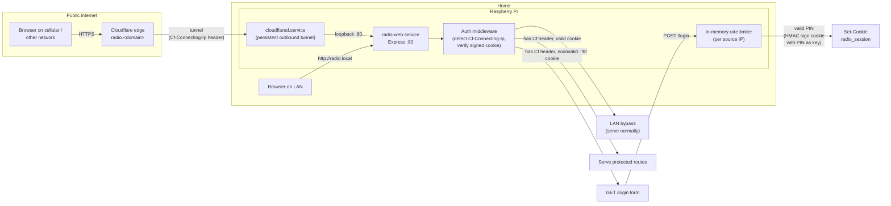

# feat: Remote Access via Cloudflare Tunnel + Shared PIN

## Summary

Add a public HTTPS path to the Pi controller at `radio.<user-domain>` via Cloudflare Tunnel, gated by a shared PIN with a 7-day signed-cookie session. LAN access at `http://radio.local` continues unchanged. The PIN signing key drives session validity, so rotating the PIN cleanly invalidates all sessions.

---

## Problem Frame

Today the controller is reachable only on the home LAN at `http://radio.local`. When the operator is travelling or on cellular, there is no path to change stations, check status, restart the bridge, or hand a friend a URL. See origin: `docs/brainstorms/remote-access-requirements.md` for the full framing.

---

## High-Level Technical Design

*This illustrates the intended approach and is directional guidance for review, not implementation specification. The implementing agent should treat it as context, not code to reproduce.*



Key design points:
- **Stateless sessions.** The session cookie is an HMAC-SHA256 signed token over `{exp, iat}` using the PIN as the signing key. No server-side session store. Rotating the PIN changes the signing key and invalidates every outstanding cookie at once.
- **Trust signal is a header, not source IP.** `Cf-Connecting-Ip` is injected by Cloudflare's edge on every tunneled request and is never present on LAN traffic. Source-IP CIDR checks fail because cloudflared connects to the Express app from `127.0.0.1`.
- **Rate limiter is in-memory only.** Sliding-window counter keyed by source IP. Reset on service restart is acceptable at single-Pi scale.

---

## Requirements Trace

Origin: `docs/brainstorms/remote-access-requirements.md`

| Origin ID | Lands in |
|---|---|
| R1 (HTTPS at `radio.<domain>`) | U5 (env file), U6 (cloudflared) |
| R2 (no port forwarding) | U6 (cloudflared) |
| R3 (LAN unchanged, no PIN) | U1 (LAN detection), U3 (wiring) |
| R4 (shared PIN gate) | U1 (PIN check), U2 (login route) |
| R5 (PIN out of source control, rotatable) | U5 (env file in `/etc`) |
| R6 (rate limit on failed attempts) | U1 (rate limiter inside auth module) |
| R7 (cookie session) | U1 (signed cookie helpers) |
| R8 (rotation invalidates sessions) | U1 (PIN as signing key) |
| R9 (full control past gate) | U3 (middleware covers all routes), U4 (UI redirect preserves the post-gate surface) |
| R10 (LAN bypass vs tunnel) | U1 (header detection) |
| R11 (Cloudflare Tunnel, free tier) | U6 (cloudflared setup) |
| R12 (tunnel creds out of source control) | U6 (creds in `/etc`, gitignored) |
| R13 (LAN works when tunnel is down) | U6 (cloudflared is independent service) |
| R14 (auto-reconnect on reboot) | U6 (systemd unit with `Restart=always`) |
| F1 (remote operator session) | U2 + U7 (login flow + UI redirect) |
| F2 (PIN rotation) | U5 (env file edit + restart) |
| AE1–AE6 | Covered in test scenarios per unit |

---

## Implementation Units

### U1. Auth module (detection, signed cookies, PIN verify, rate limit)

**Goal:** A single `auth.js` module exposing the primitives the rest of the plan composes — tunnel detection, constant-time PIN check, signed-cookie sign/verify, rate-limiter check/record.

**Requirements:** R3, R4, R6, R7, R8, R10. Covers AE1, AE2.

**Dependencies:** none.

**Files:**
- `auth.js` (new)
- `test/auth.test.js` (new)

**Approach:**
- `isTunneled(req)` → `Boolean(req.get('Cf-Connecting-Ip'))`. Single source of truth; every other module asks via this helper.
- `verifyPin(submitted, expected)` uses `crypto.timingSafeEqual` after length normalization. Returns false on length mismatch without throwing.
- `signSession(payload, pin)` returns base64url(JSON) + `.` + base64url(HMAC-SHA256(pin, body)).
- `verifySession(cookieValue, pin)` rejects on missing/malformed/invalid HMAC/expired-exp. Returns `null` on failure, payload on success.
- Rate limiter is an in-memory `Map<ip, { firstFailAt, fails }>`. `recordFailure(ip)` increments, `isLockedOut(ip)` returns true while `fails >= MAX_FAILS` and `now - firstFailAt < LOCKOUT_MS`. Window resets on success or after `LOCKOUT_MS`. Defaults: `MAX_FAILS=5`, `WINDOW_MS=5*60_000`, `LOCKOUT_MS=15*60_000`.
- **Source-IP key MUST be `req.get('Cf-Connecting-Ip') || req.ip`, not `req.ip` alone.** Behind cloudflared, the socket peer is always `127.0.0.1`, so keying on `req.ip` collapses every remote attacker into one shared bucket — five failures from anyone locks out the legitimate operator. The auth module exposes `ipForRateLimit(req)` for the login route to use.
- Constants `SESSION_MAX_AGE_MS = 7*24*60*60*1000`, `COOKIE_NAME = 'radio_session'`, exported.
- Module exports both the helpers and a factory `createRateLimiter()` so tests can instantiate isolated state.

**Patterns to follow:**
- Mirror `alsa.js` / `evenings.js` shape: pure functions + named error classes, no Express coupling.
- Use `node:crypto` only; do not introduce `jsonwebtoken`, `cookie-session`, or `bcrypt`. The cryptographic surface is small enough to write directly.

**Test scenarios:**
- `isTunneled` returns true when `Cf-Connecting-Ip` is set, false when absent, false on empty-string header.
- `verifyPin` returns true on exact match, false on different content, false on different length, does not throw on empty input.
- `signSession` round-trips: `verifySession(signSession({ exp, iat }, pin), pin)` returns the payload.
- `verifySession` returns `null` when signed with a different PIN. (Covers AE4 at the unit level.)
- `verifySession` returns `null` when `exp` is in the past.
- `verifySession` returns `null` for malformed input (missing dot, non-base64, truncated HMAC).
- `ipForRateLimit` returns `Cf-Connecting-Ip` when present, falls back to `req.ip` otherwise.
- Rate limiter: after `MAX_FAILS` failures from one IP within the window, `isLockedOut` is true; failures from a different IP are independent. (Covers AE2.)
- Rate limiter: a successful entry resets the counter for that IP.
- Rate limiter: after `LOCKOUT_MS` elapses (use injected clock), counter resets.

**Verification:** `npm test` passes the new `test/auth.test.js` suite. No file outside `auth.js` and its test imports this module yet.

---

### U2. Login page + POST /login + POST /logout

**Goal:** Three new HTTP surfaces — a minimal HTML PIN entry page, the form submission handler that issues the cookie, and a logout endpoint that clears it.

**Requirements:** R4, R7. Covers AE1.

**Dependencies:** U1.

**Files:**
- `server.js` (modify — register routes before the SPA fallback)
- `views/login.html` (new — single-file static template)
- `test/server.test.js` (extend)

**Approach:**
- `GET /login` serves a self-contained HTML page at `views/login.html`. The template contains two literal placeholder tokens — `__ERROR__` and `__RETURN__` — substituted via `String.prototype.replaceAll` at request time. Both substitutions go through a 5-line `escapeHtml(s)` helper that maps `&<>"'` to entity references. Without this, the `return` query parameter reflected into the hidden field's `value` attribute is a stored-XSS vector.
- **Login page UX specifics** (resolved here so the implementer doesn't reinvent):
  - PIN field: `<input type="password" id="pin" name="pin" autocomplete="current-password" autofocus required>` with a visible `<label for="pin">PIN</label>`. `type="password"` masks the value, triggers password-manager autofill, and matches the alphanumeric PIN shape. `autofocus` ensures the mobile keyboard appears on page load.
  - Submit: `<button type="submit">Unlock</button>` so the Enter key submits natively.
  - Error region: a single `<p class="login-error" role="alert" aria-live="polite">__ERROR__</p>` placed directly above the submit button. Hidden via `display:none` (and not rendered into the DOM at all) when `__ERROR__` is empty.
  - Lockout state: when locked out, the same `login-error` shows the lockout message AND the form's PIN input + submit are rendered with `disabled` set, so it's visually obvious the user cannot retry yet.
  - Page identity: include the existing `` and a wordmark reading `radio` in the page header so the gate visibly belongs to this product. Page background uses the SPA's `--cream-bright` / gradient palette by literal hex values (the page can't import `src/theme.css` because it's pre-Vite).
  - Typography: inline `<style>` with `font-family: 'IBM Plex Sans', system-ui, -apple-system, sans-serif`. Falls back to system-ui cleanly when @fontsource isn't loaded; the SPA carries the typographic brand once the user is past the gate. (Rejected alternatives: Google Fonts CDN — privacy/CSP cost; serving Vite-built woff2s from Express — content-hash fragility.)
  - Page title: `<title>radio — sign in</title>` (distinct from the SPA's `radio.local` so the tab title makes sense for both local and remote contexts).
- `POST /login` reads `pin` and `return` from `application/x-www-form-urlencoded` body. Steps: check rate-limit using `ipForRateLimit(req)` (see U1) → on lockout, render the page with the lockout message and disabled form → otherwise compare submitted PIN against `process.env.RADIO_PIN` via `verifyPin` → on miss, `recordFailure(ip)` then re-render the page with "Incorrect PIN" → on hit, build a cookie payload `{ iat: now, exp: now + 7d }`, sign with PIN, set `Set-Cookie: radio_session=<value>; HttpOnly; Secure; SameSite=Lax; Path=/; Max-Age=604800`, redirect 303 to the sanitized `return` path (default `/`).
- `POST /logout` clears the cookie (same name, empty value, `Max-Age=0`) and redirects to `/login`. No SPA-side affordance for now; logout is operator-only via direct URL invocation or PIN rotation. Documented under "Deferred to Follow-Up Work."
- **Return-URL sanitization is URL-parser-based, not regex-based:** parse the `return` value as `new URL(value, 'http://placeholder.invalid/')`. If the parsed URL's `host` is anything other than `placeholder.invalid`, reject as off-host and default to `/`. Use only `parsed.pathname + parsed.search + parsed.hash` for the redirect target. This blocks `/.evil.com/`, `/%2F/evil.com/`, `//evil.com/`, `https://evil.com/`, percent-encoded CRLF, and other variants in one rule. Also explicitly reject any return value containing `\r`, `\n`, or `%0d`/`%0a` (defense-in-depth against header-splitting in the redirect `Location:` value).
- Add `express.urlencoded({ extended: false })` only on the `/login` route, not globally — keep the rest of the app on JSON only.

**Patterns to follow:**
- Existing `server.js` route order: `/api/*` first, then static, then SPA fallback. Login routes go before the SPA fallback so `/login` is not consumed by it.
- Use `path.join(__dirname, 'views', 'login.html')` rather than embedding the HTML in a template literal — keeps the markup editable and reviewable.

**Test scenarios:**
- `GET /login` returns 200 with `text/html` containing the form, an action of `/login`, and (when `?return=/presets` is set) the sanitized `return` echoed into a hidden field.
- `GET /login?return=%22%3E%3Cscript%3Ealert(1)%3C/script%3E` reflects the value as escaped HTML — response body contains `&lt;script&gt;` and `&quot;` rather than a live tag. (XSS regression.)
- `POST /login` with the correct PIN returns 303, sets a `radio_session` cookie with `HttpOnly`, `Secure`, `SameSite=Lax`, and `Max-Age` ≈ 604800 (±2s), and `Location: /` (or the sanitized return). (Covers F1.)
- `POST /login` with the wrong PIN returns 200, no cookie set, page contains "Incorrect PIN". (Covers AE1.)
- `POST /login` triggers rate-limit lockout after 5 failures; the 6th attempt returns 200 with a lockout message, the form is rendered with `disabled`, and the PIN is not compared (verify via a spy on `verifyPin` or by submitting the correct PIN during lockout and observing no cookie). (Covers AE2.)
- Rate limiter keys on `Cf-Connecting-Ip`: two failures from one `Cf-Connecting-Ip` value plus three from a second value do NOT trigger lockout for either; five from the same value do.
- `POST /login` redirects to `/` for every malicious `return` variant: `//evil.com/`, `/.evil.com/`, `/%2F/evil.com/`, `https://evil.com/`, `/foo\r\nSet-Cookie:`, `/foo%0d%0aSet-Cookie:`.
- `POST /logout` clears the cookie (`Max-Age=0`) and redirects to `/login`.
- Login routes are reachable from a request that *lacks* `Cf-Connecting-Ip` too (so direct unit testing works without mocking the header), but their effect on protected routes is covered in U3.

**Verification:** New tests pass; `curl -i http://localhost/login` renders the form locally.

---

### U3. Wire auth middleware into request pipeline

**Goal:** Apply the gate to every request that arrives via the tunnel; transparently pass through every LAN request.

**Requirements:** R3, R9, R10. Covers AE3.

**Dependencies:** U1, U2.

**Files:**
- `server.js` (modify)
- `test/server.test.js` (extend — inject `Cf-Connecting-Ip` header to simulate tunnel)

**Approach:**
- Add a single global middleware after `express.json()` and before route definitions:
  1. If `!isTunneled(req)` → `next()`. LAN traffic skips entirely.
  2. If path is `/login` or `/logout` or `/static-assets-used-by-login-page` → `next()`. The gate cannot block its own login surface.
  3. Read `radio_session` cookie. If `verifySession(cookie, process.env.RADIO_PIN)` returns a valid payload → `next()`.
  4. Otherwise: for HTML/document requests (`Accept` includes `text/html`), redirect 303 to `/login?return=<encoded original URL>`; for everything else (XHR/fetch from the SPA, `/api/*`) return `401 { error: 'auth required' }`.
- Read cookies with a tiny inline parser using `split(/;\s*/)` rather than the literal `'; '` to tolerate non-standard whitespace some mobile clients emit. Do not add the `cookie` or `cookie-parser` dependency.
- Boot-time validation: if `process.env.RADIO_PIN` is unset or empty, log a `WARN` at startup and refuse all tunneled requests with `503 { error: 'PIN not configured' }`. LAN requests still work. This avoids an "open gate" misconfiguration if the env file is missing.
- The Reboot endpoint (`POST /api/reboot`) inherits this middleware. No special handling required — operator already two-tap-confirms via the UI, and the PIN gate is the additional remote protection.

**Patterns to follow:**
- The existing `createApp({ deps })` dependency-injection pattern in `server.js`. Inject `getPin: () => process.env.RADIO_PIN` and `rateLimiter` so tests don't depend on real env vars.
- Keep middleware in `server.js`; do not split into a separate file. The function is small, and route order is easier to read in one place.

**Test scenarios:**
- Request with no `Cf-Connecting-Ip` header reaches `GET /api/status` and gets the normal 200 response (LAN bypass intact). (Covers AE3, AE5.)
- Request with `Cf-Connecting-Ip: 1.2.3.4` and no cookie:
  - `Accept: text/html` → 303 to `/login?return=%2F`.
  - `Accept: application/json` → 401 JSON.
- Request with `Cf-Connecting-Ip` and a valid cookie reaches `GET /api/status` and `POST /api/play` normally. (Covers F1 end-state, R9.)
- Request with `Cf-Connecting-Ip` and a cookie signed with the *wrong* PIN → 303 to `/login` (HTML) or 401 (API). (Covers AE4.)
- `POST /login` itself is reachable through the tunnel without a cookie (the bypass list works).
- When `getPin` returns `undefined`, tunneled requests get 503; LAN requests still work.
- `POST /api/reboot` over the tunnel without auth returns 401; with valid auth, behaves identically to today. (Covers AE6 end-to-end with U7.)

**Verification:** All existing `test/server.test.js` cases still pass (LAN behavior unchanged). New tunnel-path cases pass.

---

### U4. Frontend: handle 401 by redirecting to /login

**Goal:** When the React UI fetches the API and gets a 401, navigate the browser to `/login?return=<current-path>` so the user re-authenticates and is bounced back.

**Requirements:** R9 (UI surface preserved past the gate). Covers F1 step 2–3 from the UI side.

**Dependencies:** U3 (server must actually be returning 401 in the unauthenticated tunnel case).

**Files:**
- `src/api.ts` (modify — central 401 handling in `requestJson`/`requestText`)
- `src/__tests__/api.test.ts` (new — co-located with `src/api.ts`; `.ts` not `.tsx` since `api.ts` is not JSX)

**Approach:**
- In `src/api.ts`, after `fetch` returns, if `response.status === 401`, set `window.location.href = '/login?return=' + encodeURIComponent(window.location.pathname + window.location.search)`. Then `throw new ApiError(401, 'auth required')` so the caller's catch path runs (in practice the page is already navigating away).
- **Stampede guard.** Multiple concurrent in-flight requests can each see 401 in the same tick (the 1-Hz `useStatus` poll plus any user-initiated action). Use a module-level `let redirecting = false` in `src/api.ts`: only the first 401 assigns `window.location.href`; subsequent 401s see `redirecting === true` and just throw `ApiError(401)` without re-assigning. Also have `useStatus` short-circuit further polls once it catches a 401, so the poll doesn't keep firing during the navigation teardown.
- Do not attempt to render a "please log in" view inside the SPA — the login page is server-rendered HTML on a different route. The native browser redirect keeps the implementation simple and lets the server own the return-URL contract.
- The `useStatus` poll encounters the 401 on its first tick after a session expires; the stampede guard ensures the redirect fires exactly once and the React tree unmounts cleanly as the page navigates.

**Patterns to follow:**
- `src/api.ts` already centralizes error mapping via `toMessage` and `ApiError`. The 401 redirect plugs in at the same layer.

**Test scenarios:**
- Mocked fetch returning 401 triggers `window.location.href` assignment (use `Object.defineProperty(window, 'location', ...)` in jsdom). The assigned URL is `/login?return=<encoded current location>`.
- Mocked fetch returning 200 does not touch `window.location`.
- `ApiError` thrown after the 401 has `status === 401`.
- **Stampede regression:** two concurrent `requestJson` calls that both resolve with 401 result in only one `window.location.href` assignment. The second still throws `ApiError(401)` but does not re-assign.

**Verification:** `npm run test:frontend` passes. Manual: open the tunnel URL after rotating the PIN; the UI should drop into the login page and bounce back after re-entry.

---

### U5. Environment file + systemd unit update

**Goal:** Make `RADIO_PIN` available to the service via a root-owned env file so it stays out of source control and can be rotated by editing one file.

**Requirements:** R5, R12. Covers F2.

**Dependencies:** U3 (server must read `process.env.RADIO_PIN`).

**Files:**
- `radio-web.service` (modify)
- `INSTALL.md` (modify — add env file creation step)
- `README.md` (modify — link to the env file location and the rotate-PIN flow)
- No code or test files for this unit (operational/config change).

**Approach:**
- Add `EnvironmentFile=-/etc/radio-web.env` to the `[Service]` block of `radio-web.service`. The leading `-` makes the unit non-fatal if the file is **absent**, but lines with syntax errors are still fatal. Document in `INSTALL.md`: one `KEY=value` per line, no inline `#` comments, no leading whitespace, no DOS line endings.
- Document creating the file in `INSTALL.md`: `sudo install -m 0600 -o root -g root /dev/null /etc/radio-web.env`, then `sudo $EDITOR /etc/radio-web.env` and add `RADIO_PIN=puravida` (single line, no quoting needed).
- Document the PIN rotation flow in `README.md`: edit `/etc/radio-web.env`, then `sudo systemctl restart radio-web`. Explicitly call out: **`systemctl reload` does NOT pick up env-file changes** — must be `restart`. The restart invalidates all remote sessions (by design).
- Document the install ordering in `INSTALL.md`: create `/etc/radio-web.env` *before* the first service start, or restart the service after creating it. A service started before the env file exists will keep returning 503 to tunnel traffic until restarted, even after the file is created — the env file is read at process start, not on every request.
- Note explicitly in `INSTALL.md`: if the env file is missing or `RADIO_PIN` is unset, LAN access works but remote tunnel access returns 503 with "PIN not configured" — by design.

**Test scenarios:** None (config + docs).

`Test expectation: none -- pure operational config; behavior tested via U3 (boot-time missing-PIN handling).`

**Verification:** On the Pi, `sudo systemctl restart radio-web && sudo systemctl show radio-web | grep EnvironmentFiles` shows the path; `journalctl -u radio-web --since=-1m` shows no error; LAN access still works.

---

### U6. Cloudflare Tunnel setup (cloudflared service)

**Goal:** A persistent outbound tunnel running as its own systemd service on the Pi, terminating at `localhost:80`, fronted at `radio.<user-domain>` via Cloudflare DNS.

**Requirements:** R1, R2, R11, R13, R14.

**Dependencies:** none on app code; only needs `radio-web.service` listening on port 80 (already true).

**Files:**
- `INSTALL.md` (modify — new "Remote access (optional)" section)
- No new code; cloudflared is a third-party binary installed via the official `.deb` and configured via `cloudflared service install`.

**Approach:**
- Document the canonical setup steps in `INSTALL.md`:
  1. Install cloudflared (`curl -L --output cloudflared.deb https://github.com/cloudflare/cloudflared/releases/latest/download/cloudflared-linux-arm64.deb && sudo dpkg -i cloudflared.deb`).
  2. `cloudflared tunnel login` (opens browser, picks the operator's domain).
  3. `cloudflared tunnel create radio` (generates credentials JSON in `~/.cloudflared/<tunnel-id>.json`).
  4. `cloudflared tunnel route dns radio radio.<domain>` (creates the CNAME at Cloudflare).
  5. Create `/etc/cloudflared/config.yml` pointing the tunnel at `http://localhost:80`. The required body is:
     ```yaml
     tunnel: <tunnel-id>
     credentials-file: /etc/cloudflared/<tunnel-id>.json
     ingress:
       - hostname: radio.<domain>
         service: http://localhost:80
       - service: http_status:404
     ```
     The trailing `http_status:404` catch-all ingress rule is required — cloudflared refuses to start without it.
  6. `sudo cp ~/.cloudflared/<tunnel-id>.json /etc/cloudflared/` and `sudo chown root:root /etc/cloudflared/*` to put credentials under root ownership.
  7. `sudo cloudflared service install` (the binary's built-in installer creates `cloudflared.service` and starts it).
  8. Verify: `systemctl status cloudflared` shows active, and `curl -I https://radio.<domain>/login` returns 200.
- Document that the tunnel's outbound connection is what carries the traffic — no port forwarding needed, the home IP is never exposed.
- Note that `cloudflared.service` ships with `Restart=on-failure` by default, which satisfies R14.
- Note that if cloudflared is stopped, LAN access at `radio.local` continues to work normally (R13 follows from the services being independent).

**Test scenarios:** None (third-party tooling + operational config).

`Test expectation: none -- cloudflared is third-party software; verification is operational (curl through the tunnel).`

**Verification:** On the Pi after setup, all of these succeed:
- `systemctl is-active cloudflared` → `active`.
- `curl -sS -o /dev/null -w '%{http_code}' https://radio.<domain>/login` → `200`.
- `curl -sS -D - -o /dev/null -X POST -d 'pin=puravida' https://radio.<domain>/login | grep -i 'set-cookie\|^HTTP/'` → shows `HTTP/2 303` and a `Set-Cookie: radio_session=...` line. (The `-D -` dumps headers to stdout; `-o /dev/null` discards the body. The earlier `-i` form merged headers into the body that `-o /dev/null` then discarded — silent verification failure.)
- `sudo systemctl stop cloudflared` then `curl http://radio.local/api/status` from the home LAN still returns 200 (R13).
- `sudo reboot`, wait, then `curl https://radio.<domain>/login` returns 200 without manual intervention (R14).

---

## Output Structure

```
radio/
├── auth.js                          (NEW, U1)
├── views/
│   └── login.html                   (NEW, U2)
├── server.js                        (MODIFIED, U2, U3)
├── radio-web.service                (MODIFIED, U5)
├── INSTALL.md                       (MODIFIED, U5, U6)
├── README.md                        (MODIFIED, U5)
├── src/
│   └── api.ts                       (MODIFIED, U4)
├── test/
│   ├── auth.test.js                 (NEW, U1)
│   └── server.test.js               (MODIFIED, U2, U3)
└── src/__tests__/
    └── api.test.ts                  (NEW, U4)
```

`/etc/radio-web.env` and `/etc/cloudflared/config.yml` are operator-managed and live outside the repo.

---

## Key Technical Decisions

- **Stateless cookie sessions with the PIN as the signing key.** Eliminates the need for a session store and gives R8 (rotation invalidates sessions) for free: when the PIN changes, every outstanding HMAC fails verification. Cost: rotation requires a service restart, but that aligns with the env-file rotation flow anyway.
- **`Cf-Connecting-Ip` as the LAN-vs-tunnel signal.** Cloudflare injects it on every tunneled request; LAN traffic never has it. Source-IP-based detection fails because cloudflared connects from `127.0.0.1`, so every tunnel request would look like a LAN request. The header is a strong, stable, documented contract.
- **PIN in `/etc/radio-web.env`, not in `config.json`.** Keeps secrets out of the file the operator edits to manage presets/active station and out of any future automated config-write paths. Mode `0600`, root-owned. Service reads it via systemd `EnvironmentFile`.
- **In-memory rate limiter, not Redis or a file-backed counter.** Single-Pi appliance; reset-on-restart is acceptable and even desirable (a restart usually means the operator changed the PIN). Implementation is ~30 lines vs adding a dependency.
- **Plaintext PIN in env (not bcrypt-hashed).** A single shared secret in a root-owned file does not benefit much from hashing — the comparison is constant-time (`crypto.timingSafeEqual`), and an attacker who can read `/etc/radio-web.env` has already won. Hashing would also make the cookie-signing-via-PIN scheme harder.
- **cloudflared as its own systemd unit, not bundled into `radio-web.service`.** Each service can fail independently (satisfies R13), the tunnel binary has its own well-maintained `service install` flow, and there is no benefit to coupling them.
- **No new runtime dependencies in `package.json`.** Auth, cookies, HMAC, and rate-limiting are all in ~150 lines of plain JS using `node:crypto`. Existing dependency surface stays unchanged.

---

## System-Wide Impact

- **`radio-web.service`** gains an `EnvironmentFile` directive; behavior unchanged on LAN, gated on tunnel.
- **`server.js`** gains login routes, a global auth middleware, and reads `process.env.RADIO_PIN`. All existing `/api/*` and SPA routes acquire the gate when accessed via the tunnel.
- **`config.json` format and role unchanged**: presets and active station continue to flow through `config.read()/write()` as today. The PIN deliberately does *not* live there — see Key Technical Decisions.
- **Frontend** acquires a single redirect-on-401 behavior in `src/api.ts`. No other component changes are needed; the post-gate UX is identical to today's LAN UX.
- **Operational surface** gains a second systemd unit (`cloudflared.service`) and a new file (`/etc/radio-web.env`). PIN rotation restarts only `radio-web`; `cloudflared` runs independently and does not need to be touched. `/etc/radio-web.env` is the one new file worth backing up if the operator wants the PIN to survive a Pi reimage.

---

## Scope Boundaries

### Carried from origin

- Tailscale or any client-install VPN.
- Per-user identities, email allowlists, Google/OAuth login, magic links.
- Viewer/operator permission tiers.
- Anonymous read-only "now playing" public endpoint.
- Streaming the Pi's audio output to a remote browser.
- DDNS, port forwarding, router configuration.
- Paid infrastructure (VPS, Cloudflare paid tier).
- Captcha, MFA, hardware tokens.
- Persistent audit logging of PIN attempts beyond the rate-limit counter.

### Deferred to Follow-Up Work

- Per-IP allowlist for trusted external networks beyond the LAN-bypass rule.
- Scheduled PIN auto-rotation.
- A `/api/auth/rotate-pin` endpoint to rotate without editing the env file.
- Multi-PIN support (revocable per-recipient codes).
- Logout affordance in the SPA header (a button posting to `/logout`).
- `RADIO_REQUIRE_PIN_EVERYWHERE` env flag to disable the LAN bypass (for operators whose LAN trust model changes — regular houseguests, multi-tenant Wi-Fi).
- PWA manifest + `apple-touch-icon` for clean "Add to Home Screen" on iOS.
- CSRF token on the login form (defense-in-depth against login-CSRF from an attacker who already knows the PIN).
- Per-endpoint cooldown on `/api/reboot` (e.g., refuse if last reboot was < 5 min ago).
- Rolling session (refresh `exp` on every authenticated request) instead of fixed 7-day expiry.

---

## Risk Analysis & Mitigation

- **Risk: `Cf-Connecting-Ip` is the only signal distinguishing LAN from tunnel.** If port 80 were ever exposed directly to the public internet (firewall misconfiguration, future network change, Pi moved to a different host network), a remote attacker could *omit* `Cf-Connecting-Ip` and reach the LAN-bypass path unauthenticated. *Mitigation*: document in `INSTALL.md` a recommended `ufw` (or `iptables`) hardening rule that restricts port 80 to loopback + the home LAN subnet (e.g., `192.168.0.0/24`). This makes the LAN bypass structurally correct (network-policy enforced) rather than depending solely on the absence of one header in the real-internet path.
- **Risk: header spoof from inside the LAN.** A LAN device sending `Cf-Connecting-Ip: 1.2.3.4` gets routed *into* the auth gate, not around it — so the spoof forces PIN entry rather than bypassing it. Not a privilege escalation, but document the framing so future code changes don't introduce a "header present means trusted" optimization.
- **Risk: LAN is a trust boundary that assumes everyone on the home Wi-Fi is the operator.** Houseguests, roommates, family members, and compromised IoT devices on the LAN have unauthenticated access to reboot the Pi, change stations, and edit presets. The product accepts this (origin Scope Boundaries explicitly excludes per-user tiers and PIN-on-LAN). *Mitigation*: document the assumption in `INSTALL.md` so the operator is aware. If the operator's home network composition ever changes (regular houseguests, multi-tenant Wi-Fi), they can opt into PIN-on-LAN as follow-up work.
- **Risk: PIN brute force over the tunnel (online).** *Mitigation*: rate limiter at 5 attempts / 5 min / 15 min lockout, keyed on `Cf-Connecting-Ip`. With an 8-character alphanumeric PIN, online brute force through the lockout is infeasible.
- **Risk: offline brute force of the PIN given a leaked cookie.** Because the cookie's HMAC uses the PIN itself as the signing key, an attacker who obtains a single valid cookie can run offline guessing at arbitrary bandwidth. `puravida` (8 lowercase chars) cracks in seconds on a commodity GPU and is in any dictionary. **Mitigation options** (one to be chosen and applied during implementation, not silently picked): (a) introduce a separate `SESSION_SECRET` (32 random bytes in `/etc/radio-web.env`) used as the HMAC signing key, with `pin_fingerprint = HMAC(SESSION_SECRET, PIN)` included as a verified claim — preserves R8 (rotation invalidates sessions via fingerprint change) without leaking the PIN to offline attackers; (b) require the operator to choose a high-entropy PIN (>= 12 chars, mixed classes, banned-wordlist check on startup) and accept the offline-leak risk; (c) stretch the PIN via `scrypt` before using it as the HMAC key, accepting the design's intrinsic offline-leakage but raising the per-guess cost. See "Outstanding Questions → Resolve Before Implementation."
- **Risk: PIN reuse re-validates old cookies.** If the operator rotates `puravida` → `newpin42` → `puravida` (or restores a backup), cookies issued during the first `puravida` period become valid again because the HMAC signing key matches. *Mitigation*: include a service-start timestamp (`boot_iat`) in the cookie payload and reject cookies with `iat < process.start_time`. Documented as part of U1's session payload shape.
- **Risk: env file accidentally committed.** *Mitigation*: file lives in `/etc/`, not in the repo. Nothing in the repo references its contents directly. Document the location and permissions in `INSTALL.md`.
- **Risk: cloudflared outage takes down remote access.** *Mitigation*: R13 — LAN still works. Operator awareness via the documented dependency in `INSTALL.md`.
- **Risk: PIN appears in process listings via `RADIO_PIN=puravida node server.js`.** *Mitigation*: systemd `EnvironmentFile` sets env vars in the process environment, not on the command line, so `ps -ef` does not reveal it. `cat /proc/<pid>/environ` does — but that requires root.
- **Risk: remote reboot endpoint is single-gate.** A user authenticated with the PIN can `curl -X POST /api/reboot` directly and reboot the Pi. The two-tap confirmation in U7 is UI-only and does *not* enforce a second gate at the API. A hostile actor with the PIN can reboot the Pi in a loop. *Mitigation*: documented honestly here so the operator can decide whether to add per-endpoint cooldown to `/api/reboot` as follow-up work. See "Outstanding Questions → Resolve Before Implementation."
- **Risk: Pi clock drift breaks 7-day session semantics.** Raspberry Pi has no battery-backed RTC. After a reboot during an internet outage, the system clock can be off by years until `systemd-timesyncd` syncs. Cookies signed against a wrong clock have wrong `exp` values. *Mitigation*: U1 adds a startup clock-sanity check — if `Date.now() < <build-baseline-epoch>`, log loudly and refuse to sign cookies until the clock is plausible. `systemd-timesyncd` is enabled by default on Pi OS, so the failure window is short in practice.
- **Risk: PIN rotation race.** Between editing `/etc/radio-web.env` and running `systemctl restart radio-web`, the running service still serves the old PIN and old cookies remain valid. *Mitigation*: README documents rotation as a single chained command (`sudo $EDITOR /etc/radio-web.env && sudo systemctl restart radio-web`) and explicitly notes that `systemctl reload` does not pick up env-file changes.

---

## Operational / Rollout Notes

- Land U1–U4 in a single commit cluster; the system is fully testable in isolation (LAN-bypass means no behavior change for the operator's daily home use).
- U5 (env file + service) and U6 (cloudflared) are operational steps on the Pi after the code is deployed. Order: install env file → restart radio-web → install cloudflared → verify tunnel.
- Existing service-restart cadence is unchanged; the only new operational ritual is editing `/etc/radio-web.env` when rotating the PIN.
- After first remote-access verification, consider documenting the `Add to Home Screen` install path on iOS so the gate becomes a once-per-7-days speed bump rather than friction.

---

## Outstanding Questions

### Resolve Before Implementation

- **PIN signing-key strategy.** Pick one before U1 starts: (a) separate `SESSION_SECRET` in env file, with `pin_fingerprint = HMAC(SESSION_SECRET, PIN)` claim — removes offline brute-force vulnerability of PIN-as-key; (b) accept the PIN-as-key design and require a high-entropy PIN (>= 12 chars, mixed classes); (c) scrypt-stretch the PIN before using as the HMAC key. See Risk Analysis for full trade-offs.
- **Remote reboot protection.** Accept single-gate (current plan) or add per-endpoint cooldown to `/api/reboot` (refuse if last reboot was < 5 min ago).

### Deferred to Implementation

- Final pixel-level visual treatment of the login page within the constraints already specified (input type, label, autofocus, error region, page identity, font fallback).
- Exact log format for PIN-failure events. Suggest: a single `[auth] failed pin from <ip-hash>` line at `console.warn` level so journalctl captures it; no PII beyond an IP hash. Defer to implementation.
